All roads lead to cpu

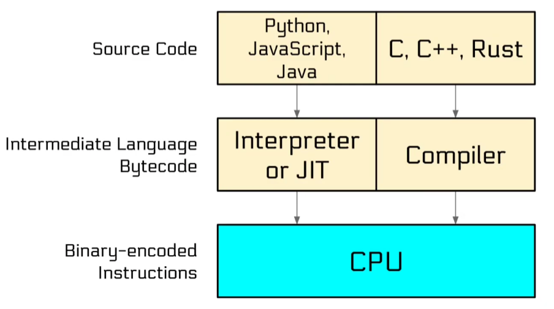

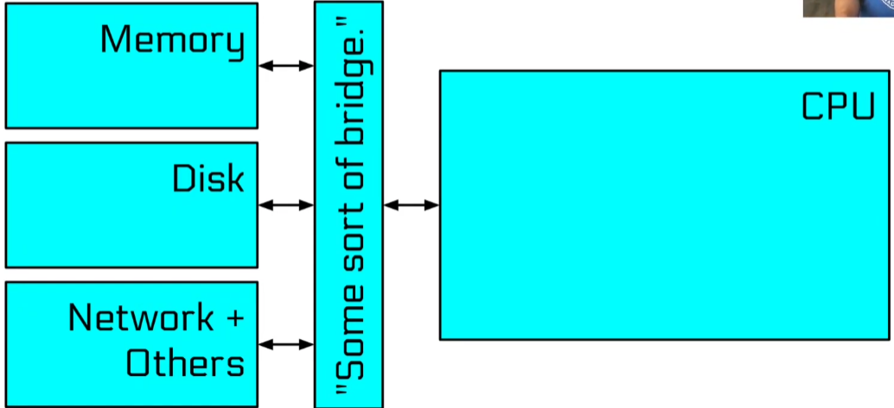

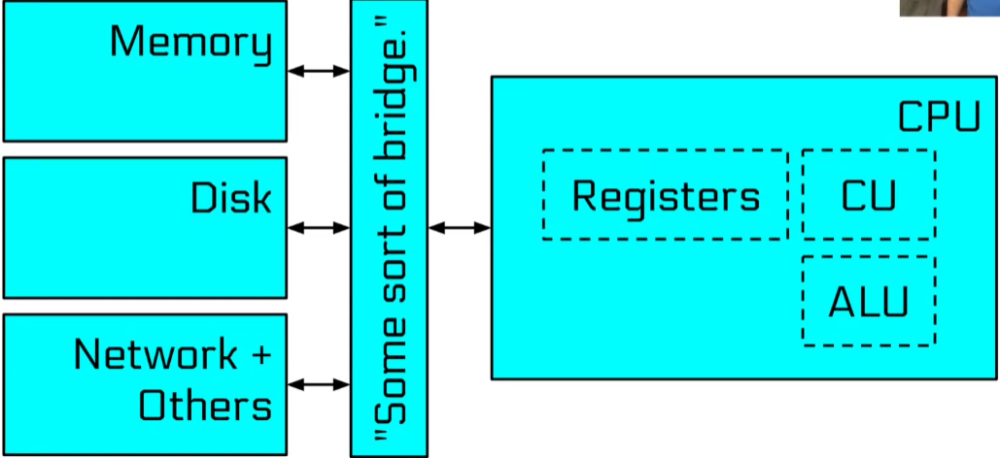


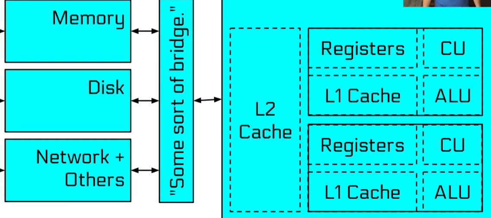

Assembly is text representation of binary.

Assembly was assembled into binary code not compiled 
Assembly is direct translation of binary code ingested by the cpu, so its very cpu architechture dependent

Dialects of Assembly
- x86
- arm
- mips
- risc-v

```txt
OPERATION OPERAND OPERAND
```

Sub dialects of x86
- Intel
- AT&T

Intel literally made the x86 architecture so their syntax is better and prefered

Computers speak binary cause of the logic gates. "on" and "off" are relatively easy to check for as
we only have to check for 2 voltage levels

Text encoding we use it ASCII
ASCII has evolved into UTF-8 used on 98% of web
A = 0x41
a = 0x61
1 = 0x31

Words are grouping of bytes
Architecture defines the word width
Nibble = 4bits
Byte = 8 bits
HalfWord/Word = 16 bits
Double Word/dword = 32 bits
Quad Word/qword = 64 bits

A 64 bit machine can work with 64 bits at a time 

##### Expressing Negative Numbers

One Idea : sign bit
Use the leftmost bit as sign bit
b00000011 = 3
b10000011 = -3
Drawback 1, we have 2 ways of expressing 0
0 = b00000000 = b10000000
Drawback 2, arithematic operations have to be signed aware
unsigned : b00000000 - 1 = 0 - 1 = 255 = b11111111
signed : = b00000000 - 1 = 0 - 1 = -1 = b10000001 (first bit represents sign, rest is same as positive number)

Clever but crazy approach
Negative numbers are represented as large positive numbers that they would corelate to

0 - 1 = b11111111 = 255 = -1
-1 -1 = b11111110 = 254 = -2

The leftmost bit here is still the signed bit(for easy testing of negative numbers)
Advantage : Arithematic operations dont have to be signed aware
Smallest expressible negative number(8 bits) = b100000000 = -128
Largest expressible negative number(8 bits) = b01111111 = 127
Also only 1 representation of 0

#### Registers

Registers are very fast, temporary stores for data
Register are typically the same size as the word width of architecture
On a 64 bit architecture most registers will hold 64 bits

Registers live in our cpu
Some registers can be accessed partially

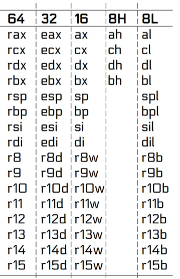

We load data into registers using 'mov' instruction
'mov' dosent move data, it copies it

Consider 
```asm
move eax, -1
```
eax is now 0xffffffff(both 4294967295 and -1) but
rax is now 0x00000000ffffffff(only 4294967295)
What if we wanted rax to also have the same sign, can we extend that sign?

```asm
mov eax, -1
movsx rax, eax
```

'movsx' does a sign-extending move, preserving the 2's complement value(i.e copies the top bit to the rest of the register)
'eax' is now 0xffffffff(both 4294967295 and -1)
rax is now 0xffffffffffffffff(both 4294967295 and -1)

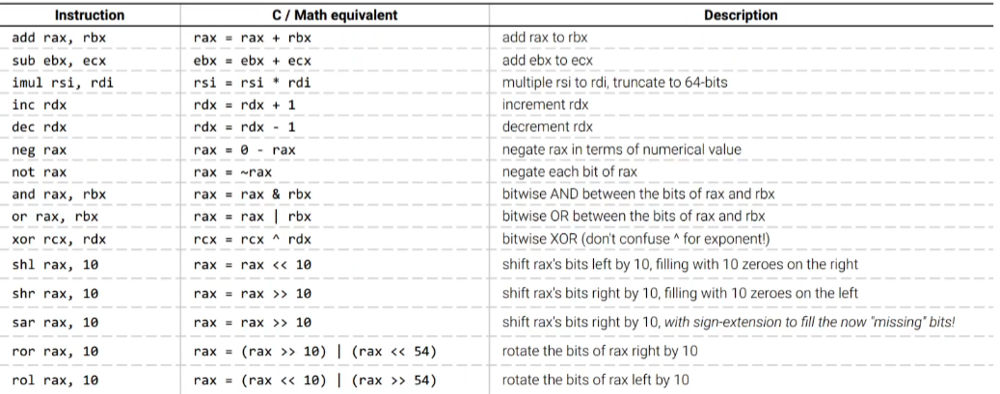

Some registers are special
Example rip : we cannot read from or write to it directly
contains address of next instruction to be excuted(instruction pointer)
 
rsp : Stack pointer contains address of a region of memory to store temporary

#### Memory

Each memory address refrences one byte in memory 
Process memory are addressed linearly
From 0x10000 
To : 0x7fffffffffff(for architecture/OS purpose)(we have to remember we cannot access top 4 hex as those are non cannonical address)
So we can only access first 12 hex of RAM which are the cannonical address
This means 127 terabytes of addressable RAM! 
How can we have this much memory address if we dont have this much RAM
We dont have 127Terabytes of RAM.. but thats ok cause its all virtual

##### Stack
If we want to store a value in memory on stack for temporary storage, we can push it onto the stack
Values can be popped right back off
***Even on 64 bit systems we can only push 32 bit immediate values***

Pop actually does not remove the value from the stack, it actually still there, we just redifine where the stack ends

Addressing the Stack

Stack is somewhere in memory at an address. 
The cpu knows where the stack is because its address is stored in rsp
Stack is in very high memory because it grows backwards, it grows towards smaller memory address
Push subtracts 8 from rsp, Pop adds 8 to rsp

The equivalent of push would be 
```asm
sub rsp, 8
mov [rsp], ourData
```

Each memory location contains 1 byte

Memory Endianess
Data on most mordern systems is stored backwards, little endian : LSB stored at smallest memory address
Bytes are only shuffled for multi bytes stores and loads of registers to memory
Individual bytes never have their bits shuffled

Address Calculation

Use rax as an offset off some base address(in this case the stack)

```asm
mov rax, 0
mov rbx, [rsp+rax*8]
inc rax
mov rcx, [rsp+rax*8]
```

We can get the calculated address using lea(load effective address)

Address calculation has a limit
reg + reg*(2 or 4 or 8) + value is as good as it gets

**lea is one of the few instructions that can directly access the rip register**

#### Control Flow

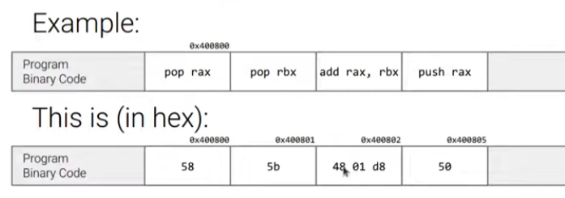

CPU executes instruction in sequential manner until and unless told not to
One way to interupt a sequence is with 'jmp' jump instruction

Conditional Jumps

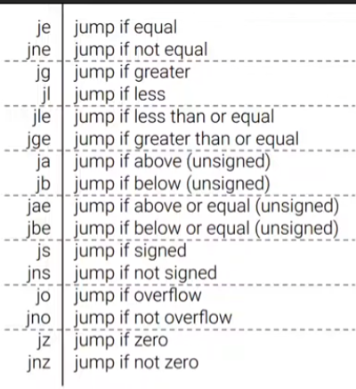

Conditional jumps check conditions stored in the "flags" register : rflags

Flags are updated by :
- most arithematic instructions
- comparions instruction cmp(sub, but discards the result)
- comparison instruction test(and, but discards the result)

Main conditional flags
Carry flag : was the 65th bit 1
Zero flag : was the result 0
Overflow flag : did the result wrap between positive adn negative
Signed flag : was the results signed bit set(i.e was it negative)

Thanks to 2's complement, only jumps themselves have to bee signedness-aware

ja : jump if above(unsigned)
jg : jump if greater than(signed)

Same thing, its just 1 is signed and other is unsigned

Looping : with our conditional jumps, we can implement looping 

```asm
mov rax, 0
LOOP_HEADER
inc rax
cmp rax, 10
jb LOOP_HEADER // jump to the label if value is below 10
```

This is a program to count till 10

Function Calls

Assembly code is split into functions with 'call' and 'ret'
'call' pushes 'rip' and jumps away
'ret' pops 'rip' and jumps to it

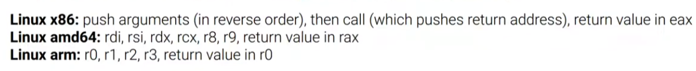

Registers are shared between functions so calling conventions should agree on what registers are protected

#### System Calls

How do we interact with the outside world?
Even something as simple as quitting the program?

We use system call to exit
**System call : Its an instruction that makes a call into the operating system**

```asm
syscall
```

syscall triggers a system call specified by the value in rax
arguments in rdi, rsi, rdx, r10, r8, r9
return value in rax

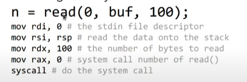


The c code is equivalent to the assembly code, first move the arguements into the registers, then the syscall number in rax
Some system calls take string argument(for example file paths)
A string is a bunch of contiguous blokcs in memory followed by a null byte

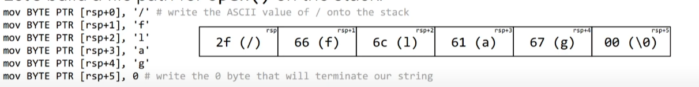

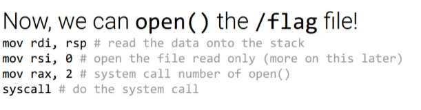

Some system calls require constants as an argument

Finally we can quit

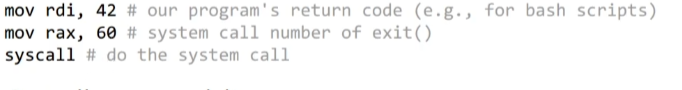

#### Building Programs

We have to tell the assembler what syntax we are using
".intel_syntax"
"noprefix" : this tells the assembler we will not prefix all register names with %

```asm
.global _start
_start:
.intel_syntax noprefix
mov rdi, 42 #our programs return code
mov rax, 60 #system call number of exit()
syscall # do the system call
```

```sh
gcc -nostdlib -o quitter quitter.s
```

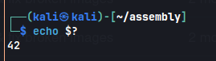

We can view our programs return code using 
```sh
echo $?
```

To get the assebly back

```sh
objdump -M intel -d quitter
```

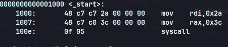

There is an instruction "int3", it itself is a breakpoint, it triggers a debugger with a breakpoint

Steps to solve the dojo

1) "as -o asm.o asm.S"   (run these commands in terminal without the quotes, asm.s is the file we wrote our code in)
2) "objcopy -O binary --only-section=.text asm.o asm.bin"
3) "cat ./asm.bin | /challenge/run"


```sh
as -o asm.o asm.S && objcopy -O binary --only-section=.text ./asm.o ./asm.bin && cat ./asm.bin | /challenge/run
```


Many instructions exist in x86 that allow you to do all the normal
math operations on registers and memory.

For shorthand, when we say A += B, it really means A = A + B.

Here are some useful instructions:

```asm
  add reg1, reg2       <=>     reg1 += reg2
  sub reg1, reg2       <=>     reg1 -= reg2
  imul reg1, reg2      <=>     reg1 *= reg2
```

***All 'regX' can be replaced by a constant or memory location***

#### f(x) = mx + b, where:
    m = rdi
    x = rsi
    b = rdx

there is an important difference between mul (unsigned
multiply) and imul (signed multiply) in terms of which
registers are used

```asm
    intel_syntax noprefix

    .global _start
    
    start:
    
    imul rdi, rsi
    add rdi, rdx
    mov rax, rdi
```

Division in x86 is more special than in normal math. Math in here is
called integer math. This means every value is a whole number.

As an example: 10 / 3 = 3 in integer math.

Why?

Because 3.33 is rounded down to an integer.

The relevant instructions for this level are:
  mov rax, reg1; div reg2

Note: div is a special instruction that can divide
a 128-bit dividend by a 64-bit divisor, while
storing both the quotient and the remainder, using only one register as an operand.
How does this complex div instruction work and operate on a
128-bit dividend (which is twice as large as a register)?

For the instruction: ***div reg***, the following happens:
  ***rax = rdx:rax / reg***
  ***rdx = remainder***
***rdx:rax means that rdx will be the upper 64-bits of the 128-bit dividend and rax will be the lower 64-bits of the 128-bit dividend.***
**You must be careful about what is in rdx and rax before you call div.**

#### Please compute the following:
  speed = distance / time, where:
    distance = rdi
    time = rsi
    speed = rax

distance will be at most a 64-bit value, so rdx should be 0 when dividing.h

```asm
.intel_syntax noprefix

.global _start

_start:

      mov rax, rdi
      div rsi
```

x86 allows you to get the remainder after a div operation.
For instance: 10 / 3 -> remainder = 1

The remainder is the same as modulo, which is also called the "mod" operator.

```asm
.intel_syntax noprefix

.global _start

_start:
      
      mov rax, rdi
      div rsi
      mov rax, rdx # rdx stores the remainder of the division operation
```

Another cool concept in x86 is the ability to independently access to lower register bytes.

We can also access the lower bytes of each register using different register names.

For example the lower 32 bits of rax can be accessed using eax, the lower 16 bits using ax,
the lower 8 bits using al.

MSB                                    LSB
+----------------------------------------+
|                   rax                  |
+--------------------+-------------------+
                     |        eax        |
                     +---------+---------+
                               |   ax    |
                               +----+----+
                               | ah | al |
                               +----+----+

Lower register bytes access is applicable to almost all registers.

Using only one move instruction, please set the upper 8 bits of the ax register to 0x42.

```asm
.intel_syntax noprefix

.global _start

_start:

      mov ah, 0x42
```

It turns out that using the div operator to compute the modulo operation is slow!

We can use a math trick to optimize the modulo operator (%). Compilers use this trick a lot.

***If we have "x % y", and y is a power of 2, such as 2^n, the result will be the lower n bits of x.***
Therefore, we can use the lower register byte access to efficiently implement modulo!

#### Using only the following instruction(s):
  mov

Please compute the following:
  rax = rdi % 256
  rbx = rsi % 65536

```asm
.intel_syntax noprefix

.global _start

_start:
      
      mov al, dil
      mov bx, si
```

Shifting bits around in assembly is another interesting concept!

x86 allows you to 'shift' bits around in a register.

Take, for instance, al, the lowest 8 bits of rax.

The value in al (in bits) is:
  rax = 10001010

If we shift once to the left using the shl instruction:
  shl al, 1

The new value is:
  al = 00010100

Everything shifted to the left and the highest bit fell off
while a new 0 was added to the right side.
You can use this to do special things to the bits you care about.

Shifting has the nice side affect of doing quick multiplication (by 2)
or division (by 2), and can also be used to compute modulo.

Here are the important instructions:

```asm
  shl reg1, reg2       <=>     Shift reg1 left by the amount in reg2
  shr reg1, reg2       <=>     Shift reg1 right by the amount in reg2
```  
***'reg2' can be replaced by a constant or memory location***

#### Using only the following instructions:
  mov, shr, shl

Please perform the following:
  Set rax to the 5th least significant byte of rdi.

For example:
  rdi = | B7 | B6 | B5 | B4 | B3 | B2 | B1 | B0 |
  Set rax to the value of B4

```asm
.intel_syntax noprefix

.global _start

_start:
      
      shl rax, edi
```
***shl rax, edi is incorrect. The shl instruction does not allow the second operand to be a general-purpose register other than cl. The correct way to use a variable shift amount is by first moving the value into cl and then performing the shift operation.***

```asm
.intel_syntax noprefix

.global _start

_start:
      
      shr rdi, 32
      shl rdi, 56
      shr rdi, 56
      mov rax, rdi
```

shr rdi, 32
This instruction shifts the bits of rdi to the right by 32 positions. This operation discards the lower 32 bits of rdi, moving the 5th least significant byte into the position of the least significant byte.
The original rdi value is right-shifted.
The 5th least significant byte of rdi is moved to the position of the least significant byte

shl rdi, 56
This instruction shifts the bits of rdi to the left by 56 positions. This operation moves the byte that was previously in the position of the least significant byte (from the previous step) to the most significant byte position.

The byte at the least significant position (which was the 5th least significant byte of the original rdi) is shifted to the most significant byte position.
The remaining bits are shifted out, leaving only this byte in the least significant byte position.

Example : 
Initial value of rdi: 0x1234567890ABCDEF
After shr rdi, 32: 0x90ABCDEF
After shl rdi, 56: 0x9000000000000000
After shr rdi, 56: 0x90

For the sake of this example say registers only store 8 bits.

The values in rax and rbx are:
  rax = 10101010
  rbx = 00110011

If we were to perform a bitwise AND of rax and rbx using the
"and rax, rbx" instruction, the result would be calculated by
ANDing each bit pair 1 by 1 hence why it's called a bitwise
logic.

So from left to right:
  1 AND 0 = 0
  0 AND 0 = 0
  1 AND 1 = 1
  0 AND 1 = 0
  ...

Finally we combine the results together to get:
  rax = 00100010

#### Please perform the following:
  rax = rdi AND rsi

i.e. Set rax to the value of (rdi AND rsi)

```asm
.intel_syntax noprefix

.global _start

_start:
      
     xor rax, rax # rax becomes 0
     xor rax, rdi # rax now holds the value of rdi
     and rax, rsi # performent and since rax = rdi, and we do rax & rsi

```

***To zero out any register, xor it by itself***

***To transfer a value from one register to other, without using exchange***

```asm
xor rax, rax
xor rax, rdi
```
This writes the value of rdi into rax

#### Using only the following instructions:
  and, or, xor

Implement the following logic:
  if x is even then
    y = 1
  else
    y = 0

where:
  x = rdi
  y = rax

```asm
.intel_syntax noprefix

.global _start

_start:
      
      xor rax, rax
      and rdi, 1
      xor rdi, 1
      xor rax, rdi
```

In x86 we can access the thing at a memory location, called dereferencing, like so:
  mov rax, [some_address]        <=>     Moves the thing at 'some_address' into rax

This also works with things in registers:
  mov rax, [rdi]         <=>     Moves the thing stored at the address of what rdi holds to rax

This works the same for writing to memory:
  mov [rax], rdi         <=>     Moves rdi to the address of what rax holds.

So if rax was 0xdeadbeef, then rdi would get stored at the address 0xc0debabe:
  [0xc0debabe] = rdi

Note: memory is linear, and in x86_64, it goes from 0 - 0xffffffffffffffff (yes, huge).

#### Please perform the following:
  Place the value stored at 0x404000 into rax

Make sure the value in rax is the original value stored at 0x404000.

```asm
.intel_syntax noprefix

.global _start

_start:
      
      mov rax, [0x404000]
```

#### Please perform the following:
  Place the value stored in rax to 0x404000

```asm
.intel_syntax noprefix

.global _start

_start:
      
      mov [0x404000], rax
```

#### Please perform the following:
  Place the value stored at 0x404000 into rax
  Increment the value stored at the address 0x404000 by 0x1337

```asm
.intel_syntax noprefix

.global _start

_start:
      
      mov rax, [0x404000]
      add [0x404000], 0x1337
```
**This gives error : Error: ambiguous operand size for add**
***The error occurs because the assembler cannot determine the size of the operands. To fix this, you need to specify the size of the operands explicitly.***
we can fix this by using byte, word, dword, or qword to indicate the size. For example:

byte for 8-bit operands
word for 16-bit operands
dword for 32-bit operands
qword for 64-bit operands

```asm
.intel_syntax noprefix

.global _start

_start:
      
      mov rax, [0x404000]
      add qword ptr [0x404000], 0x1337
```

Recall that registers in x86_64 are 64 bits wide, meaning they can store 64 bits.

Similarly, each memory location can be treated as a 64 bit value.

We refer to something that is 64 bits (8 bytes) as a quad word.

Here is the breakdown of the names of memory sizes:
  Quad Word   = 8 Bytes = 64 bits
  Double Word = 4 bytes = 32 bits
  Word        = 2 bytes = 16 bits
  Byte        = 1 byte  = 8 bits

In x86_64, you can access each of these sizes when dereferencing an address, just like using
bigger or smaller register accesses:

  mov al, [address]        <=>        moves the least significant byte from address to rax
  mov ax, [address]        <=>        moves the least significant word from address to rax
  mov eax, [address]       <=>        moves the least significant double word from address to rax
  mov rax, [address]       <=>        moves the full quad word from address to rax

Remember that moving into al does not fully clear the upper bytes.

#### Please perform the following:
  Set rax to the byte at 0x404000

```asm
.intel_syntax noprefix

.global _start

_start:
      
      xor rax, rax
      mov al, [0x404000]
```

#### Please perform the following:
  Set rax to the byte at 0x404000
  Set rbx to the word at 0x404000
  Set rcx to the double word at 0x404000
  Set rdx to the quad word at 0x404000

```asm
.intel_syntax noprefix

.global _start

_start:
      
      mov al, [0x404000]
      mov bx, [0x404000]
      mov ecx, [0x404000]
      mov rdx, [0x404000]
```

#### It is worth noting, as you may have noticed, that values are stored in reverse order of how we
represent them.

As an example, say:
  [0x1330] = 0x00000000deadc0de

If you examined how it actually looked in memory, you would see:
  [0x1330] = 0xde
  [0x1331] = 0xc0
  [0x1332] = 0xad
  [0x1333] = 0xde
  [0x1334] = 0x00
  [0x1335] = 0x00
  [0x1336] = 0x00
  [0x1337] = 0x00

This format of storing things in 'reverse' is intentional in x86, and its called "Little Endian".

For this challenge we will give you two addresses created dynamically each run.

The first address will be placed in rdi.
The second will be placed in rsi.

Using the earlier mentioned info, perform the following:
  Set [rdi] = 0xdeadbeef00001337
  Set [rsi] = 0xc0ffee0000

***Hint: it may require some tricks to assign a big constant to a dereferenced register.Try setting a register to the constant value then assigning that register to the dereferenced register.***


