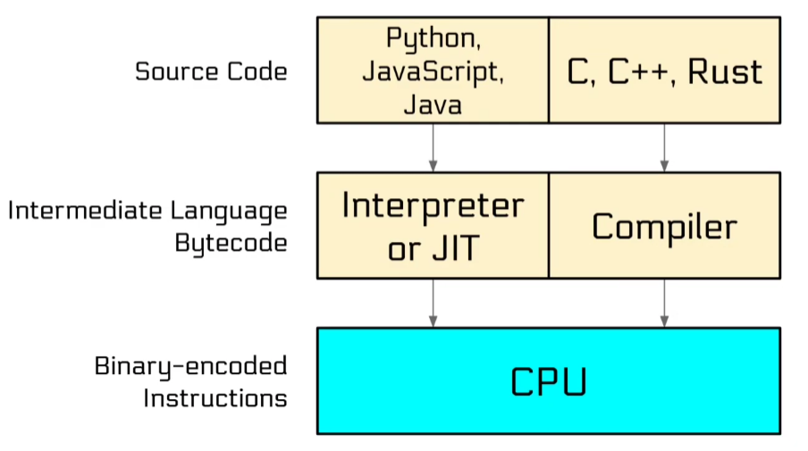
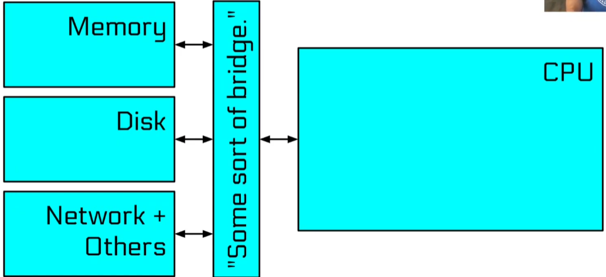
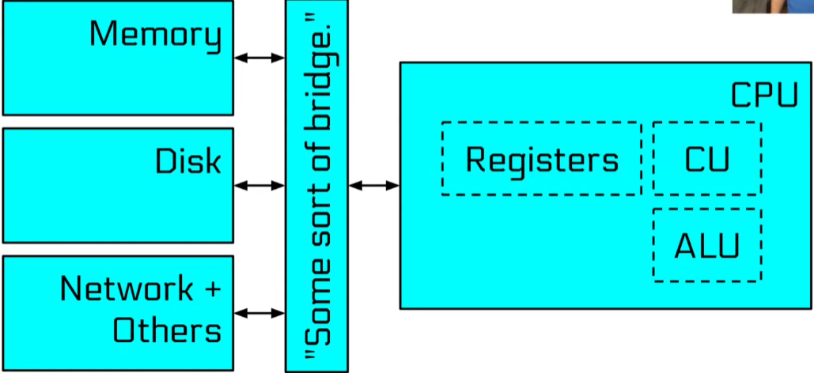
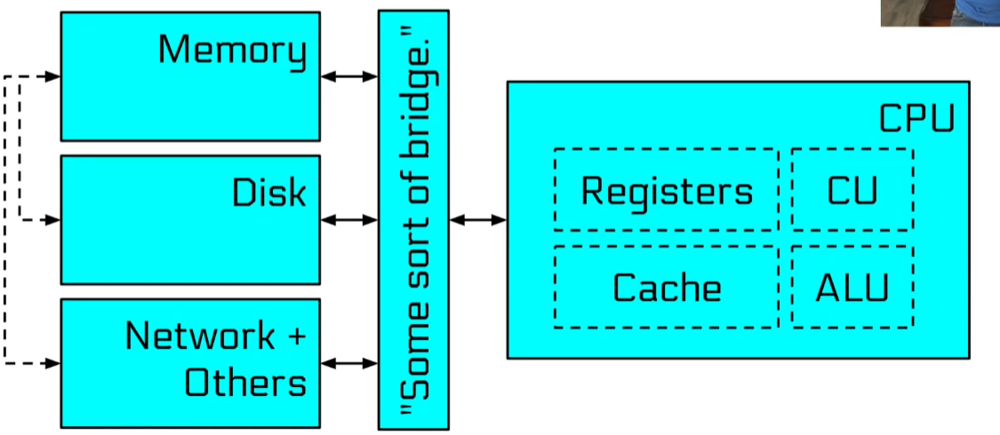
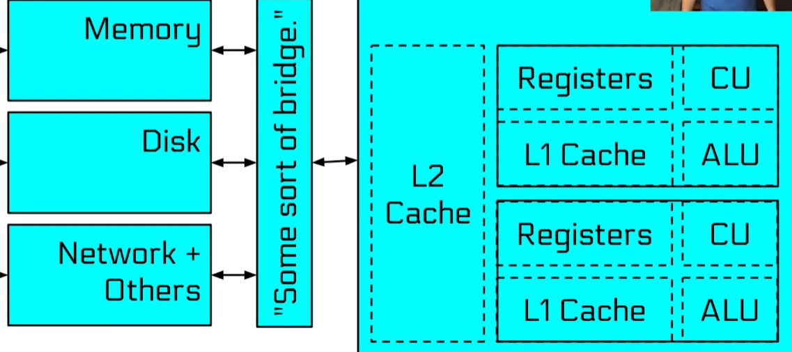
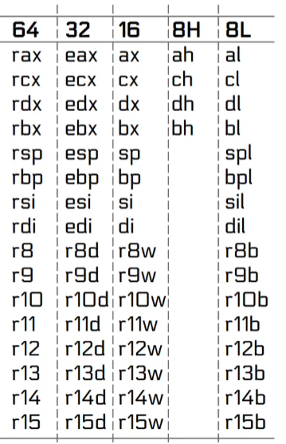
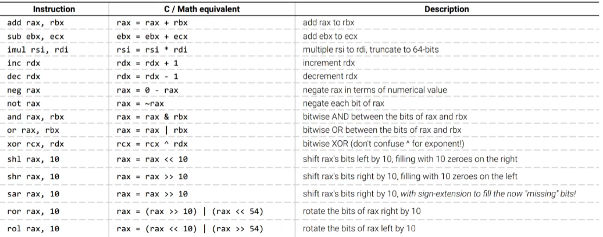

All roads lead to cpu











Assembly is text representation of binary.

Assembly was assembled into binary code not compiled 
Assembly is direct translation of binary code ingested by the cpu, so its very cpu architechture dependent

Dialects of Assembly
- x86
- arm
- mips
- risc-v

```txt
OPERATION OPERAND OPERAND
```

Sub dialects of x86
- Intel
- AT&T

Intel literally made the x86 architecture so their syntax is better and prefered

Computers speak binary cause of the logic gates. "on" and "off" are relatively easy to check for as
we only have to check for 2 voltage levels

Text encoding we use it ASCII
ASCII has evolved into UTF-8 used on 98% of web
A = 0x41
a = 0x61
1 = 0x31

Words are grouping of bytes
Architecture defines the word width
Nibble = 4bits
Byte = 8 bits
HalfWord/Word = 16 bits
Double Word/dword = 32 bits
Quad Word/qword = 64 bits

A 64 bit machine can work with 64 bits at a time 

##### Expressing Negative Numbers

One Idea : sign bit
Use the leftmost bit as sign bit
b00000011 = 3
b10000011 = -3
Drawback 1, we have 2 ways of expressing 0
0 = b00000000 = b10000000
Drawback 2, arithematic operations have to be signed aware
unsigned : b00000000 - 1 = 0 - 1 = 255 = b11111111
signed : = b00000000 - 1 = 0 - 1 = -1 = b100000001 (first bit represents sign, rest is same as positive number)

Clever but crazy approach
Negative numbers are represented as large positive numbers that they would corelate to

0 - 1 = b11111111 = 255 = -1
-1 -1 = b11111110 = 254 = -2

The leftmost bit here is still the signed bit(for easy testing of negative numbers)
Advantage : Arithematic operations dont have to be signed aware
Smallest expressible negative number(8 bits) = b100000000 = -128
Largest expressible negative number(8 bits) = b01111111 = 127
Also only 1 representation of 0

#### Registers

Registers are very fast, temporary stores for data
Register are typically the same size as the word width of architecture
On a 64 bit architecture most registers will hold 64 bits

Registers live in our cpu
Some registers can be accessed partially



We load data into registers using 'mov' instruction
'mov' dosent move data, it copies it

Consider 
```asm
move eax, -1
```
eax is now 0xffffffff(both 4294967295 and -1) but
rax is now 0x00000000ffffffff(only 4294967295)
What if we wanted rax to also have the same sign, can we extend that sign?

```asm
mov eax, -1
movsx rax, eax
```

'movsx' does a sign-extending move, preserving the 2's complement value(i.e copies the top bit to the rest of the register)
'eax' is now 0xffffffff(both 4294967295 and -1)
rax is now 0xffffffffffffffff(both 4294967295 and -1)



Some registers are special
Example rip : we cannot read from or write to it directly
contains address of next instruction to be excuted(instruction pointer)
 
rsp : Stack pointer contains address of a region of memory to store temporary

#### Memory

Each memory address refrences one byte in memory 
Process memory are addressed linearly
From 0x10000 
To : 0x7fffffffffff(for architecture/OS purpose)(we have to remember we cannot access top 4 hex as those are non cannonical address)
So we can only access first 12 hex of RAM which are the cannonical address
This means 127 terabytes of addressable RAM! 
How can we have this much memory address if we dont have this much RAM
We dont have 127Terabytes of RAM.. but thats ok cause its all virtual

##### Stack
If we want to store a value in memory on stack for temporary storage, we can push it onto the stack
Values can be popped right back off
***Even on 64 bit systems we can only push 32 bit immediate values***

Pop actuall does not remove the value from the stack, it actually still there, we just redifine where the stack ends

Addressing the Stack

Stack is somewhere in memory at an address. 
The cpu knows where the stack is because its address is stored in rsp
Stack is in very high memory because it grows backwards, it grows towards smaller memory address
Push subtracts 8 from rsp, Pop adds 8 to rsp

The equivalent of push would be 
```asm
sub rsp, 8
mov [rsp], ourData
```

Each memory location contains 1 byte

Memory Endianess
Data on most mordern systems is stored backwards, little endian : LSB stored at smalled memory address
Bytes are only shuffled for multi bytes stores and loads of registers to memory
Individual bytes never have their bits shuffled

Address Calculation

Use rax as an offset off some base address(in this case the stack)

```asm
mov rax, 0
mov rbx, [rsp+rax*8]
inc rax
mov rcx, [rsp+rax*8]
```

We can get the calculated address using lea(load effective address)

Address calculation has a limit
reg + reg*(2 or 4 or 8) + value is as good as it gets

**lea is one of the few instructions that can directly access the rip register**


