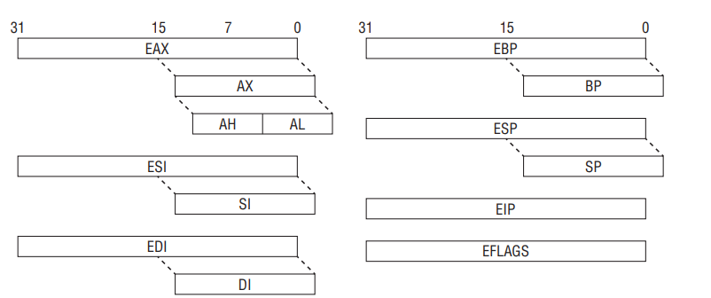

x86 is little-endian architecture based on the Intel 8086 processor
Little Endian is a byte order architecture where the least significant byte of a multi-byte data unit 
is stored at the lowest memory address

Process has 2 modes : real and protected
Real mode is the processor state when it is first powered on and only supports a 16-bit instruction set. 
Protected mode is the processor state supporting virtual memory, paging, and other features; 
it is the state in which modern operating systems execute

x86 supports the concept of privilege separation through an abstraction called 
ring level. The processor supports four ring levels, numbered from 0 to 3

Ring 0 is the 
highest privilege level and can modify all system settings. Ring 3 is the lowest 
privileged level and can only read/modify a subset of system settings. Hence, 
modern operating systems typically implement user/kernel privilege separation
by having user-mode applications run in ring 3, and the kernel in ring 0

#### Register Set and Data Types

When operating in protected mode, the x86 architecture has eight 32-bit general purpose registers 
(GPRs): EAX, EBX, ECX, EDX, EDI, ESI, EBP, and ESP
Some of them can be further divided into 8- and 16-bit registers. The instruction pointer 
is stored in the EIP register



|Register|Purpose|
|  ---   |   --- |
| ECX    | Counter in loops|
| ESI    |Source in string/memory operations|
| EDI    |Destination in string/memory operations|
| EBP    |Base frame pointer|
| ESP    |Stack pointer|

The common data types are as follows:
- Bytes—8 bits. Examples: AL, BL, CL
- Word—16 bits. Examples: AX, BX, CX
- Double word—32 bits. Examples: EAX, EBX, ECX
- Quad word—64 bits. While x86 does not have 64-bit GPRs, it can combine 
two registers, usually EDX:EAX, and treat them as 64-bit values in some scenarios. 
For example, the ***RDTSC(Read Time-Stamp Counter)*** instruction writes a 64-bit value to EDX:EAX.

The 32-bit EFLAGS register is used to store the status of arithmetic operations 
and other execution states (e.g., trap fl ag). For example, if the previous “add” 
operation resulted in a zero, the ZF fl ag will be set to 1. 
**The flags in EFLAGS are primarily used to implement conditional branching.**

In addition to the GPRs, EIP, and EFLAGS, there are also registers that control 
important low-level system mechanisms such as virtual memory, interrupts, and 
debugging. For example, CR0 controls whether paging is on or off, CR2 contains 
the linear address that caused a page fault, CR3 is the base address of a paging 
data structure, and CR4 controls the hardware virtualization settings. DR0–DR7
are used to set memory breakpoints

Although there are seven debug registers, the system allows only four memory 
breakpoints (DR0–DR3). The remaining registers are used for status.

There are also model-specific registers (MSRs). As the name implies, these 
registers may vary between different processors by Intel and AMD. Each MSR 
is identified by name and a 32-bit number, and read/written to through the 
RDMSR/WRMSR instructions. They are accessible only to code running in ring 0 and 
typically used to store special counters and implement low-level functionality. 
For example, the SYSENTER instruction transfers execution to the address stored 
in the IA32_SYSENTER_EIP MSR (0x176), which is usually the operating system’s 
system call handler.

##### Instructin Set

The x86 instruction set allows a high level of flexibility in terms of data movement
between registers and memory. The movement can be classified into five general methods
- Immediate to register
- Register to register
- Immediate to memory
- Register to memory and vice versa
- Memory to memory

The fi rst four methods are supported by all modern architectures, but the last
one is specific to x86. A classical RISC architecture like ARM can only read/write
data from/to memory with load/store instructions (LDR and STR, respectively);
for example, a simple operation like incrementing a value in memory requires
three instructions:
1. Read the data from memory to a register (LDR).
2. Add one to the register (ADD).
3. Write the register to memory (STR).
On x86, such an operation would require only one instruction (either INC or
ADD) because it can directly access memory

***Another important characteristic is that x86 uses variable-length instruction***
***size: the instruction length can range from 1 to 15 bytes. On ARM, instructions***
***are either 2 or 4 bytes in length.***

##### Syntax

Depending on the assembler/disassembler, there are two syntax notations for
x86 assembly code, Intel and AT&T:

Intel Syntax

```asm
mov ecx, AABBCCDD
mov ecx, [eax]
mov ecx, eax
```

AT&T syntax

```asm
movl $0xAABBCCDD, %ecx
movl (%eax), %ecx
movl %eax, %ecx
```

It is important to note that these are the same instructions but written differently. 
There are several differences between Intel and AT&T notation, but the
most notable ones are as follows:
- AT&T prefi xes the register with %, and immediates with $. Intel does not
do this.
- AT&T adds a prefi x to the instruction to indicate operation width. For
example, MOVL (long), MOVB (byte), etc. Intel does not do this.
- AT&T puts the source operand before the destination. Intel reverses the
order.

##### Data Movement

Instructions operate on values that come from registers or main memory. The
most common instruction for moving data is MOV. The simplest usage is to move
a register or immediate to register. For example:

```asm
01: BE 3F 00 0F 00 mov esi, 0F003Fh ; set ESI = 0xF003
02: 8B F1 mov esi, ecx ; set ESI = ECX
```

The next common usage is to move data to/from memory. Similar to other
assembly language conventions, x86 uses square brackets ([]) to indicate memory
access. (The only exception to this is the LEA instruction, which uses [] but does
not actually reference memory.) Memory access can be specifi ed in several different ways, 
so we will begin with the simplest case:

```asm
01: C7 00 01 00 00+ mov dword ptr [eax], 1
; set the memory at address EAX to 1
02: 8B 08 mov ecx, [eax]
; set ECX to the value at address EAX
03: 89 18 mov [eax], ebx
; set the memory at address EAX to EBX
04: 89 46 34 mov [esi+34h], eax
; set the memory address at (ESI+34) to EAX
05: 8B 46 34 mov eax, [esi+34h]
; set EAX to the value at address (ESI+34)
06: 8B 14 01 mov edx, [ecx+eax]
; set EDX to the value at address (ECX+EAX)
```

Pseudo C code

```c
01: *eax = 1;
02: ecx = *eax;
03: *eax = ebx;
04: *(esi+34) = eax;
05: eax = *(esi+34);
06: edx = *(ecx+eax);
```

These examples demonstrate memory access through a base register and
offset, where offset can be a register or immediate. This form is commonly used
to access structure members or data buffers at a location computed at runtime.


