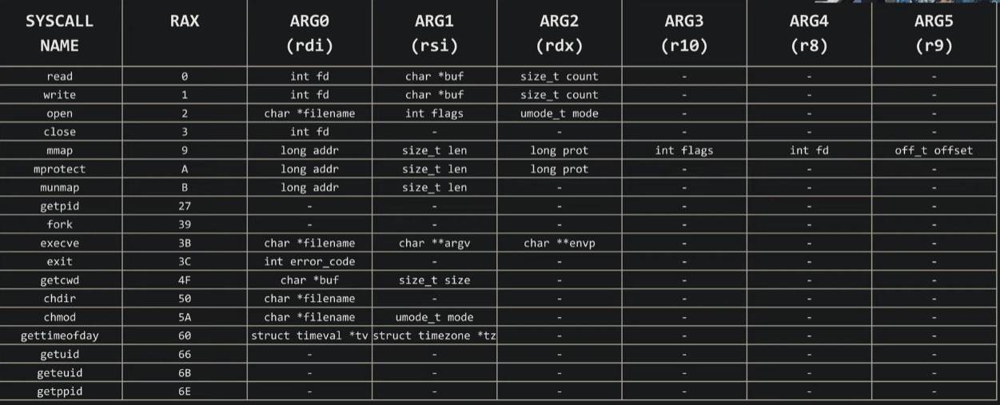

Few system calls

```c
int read(
    int fd,
    void *buf,
    size_t count
)
```
**read** attempts to read upto **count** bytes from file descriptor **fd** into the buffer starting at **buf**

```c
int write(
    int fd,
    void *buf,
    size_t count
)
```
**write** writes upto **count** bytes from the buffer starting at **buf** to the file refered to by the file descriptor **fd**

```c
int open(
    char *pathname,
    int flags,
    mode_t mode
)
```
The **open()** system call opens the file specified by the **pathname**, if the specified file does not exist, it may optionally (if O_CREAT is specified in flags) be created by **open()**
The return value of **open()** is a file descriptor, a small nonegative integer that is used in subsequent system calls(read(2), write(2), lseek(2), fcntl(2), etc.) to refer to the open file. The file descriptor returned by successful call will be the lowest numbered file descriptor not currently open for the process.

example 

```c
open("/flag", O_RDONLY, 0);
```

Before we call a system call, we need to select which one we want to call using the numbers given to each system call and move that number into the "rax" register then run the "syscall" instruction



#### Network System Calls

```c
int socket(
    int domain,
    int type,
    int protocol
)
```
**socket()** creates an endpoint for communication and returns a file descriptor that refers to that endpoint
It is a networking concept file(in linux everything is a file)

```c
int bind(
    int sockfd, //result of socket system call
    struct sockaddr *addr,
    socklen_t addrlen
)
```

When a **socket(2)** is created with **socket**, it exists in a name space(address family) but has no address assigned to it. **bind()** assigns the address specified by **addr** to the socket refered to by the file descriptor sockfd.

Networking operates on big endian


```c
int listen(
    int sockfd,
    int backlog
)
```
**listen()** marks the socket refered to by **socketfd** as passive socket, that is, as a socket that will be used to accept incoming connection requests using **accept(2)**

```c
int accept(
    int sockfd,
    struct sockaddr *addr,
    socklen_t *addrlen
)
```

The **accept()** system call is used with connection-based socket types (SOCK_STREAM, SOCK_SEQPACKET). It extracts the first connection
request on the queue of pending connections for the listening sockets, **sockfd** creates a new connected socket, and returns a new file descriptor refering to that socket.

socket() -> bind() -> listen() -> accept()

#### Multiprocessing

To handle multiple requests concurrently

**fork()** creates a new process by duplicating the calling process. The new process is refered to as the child process. The calling process is refered to as the parent process.
On success the PID of the child process is returned in the parent, and 0 is returned in the child

