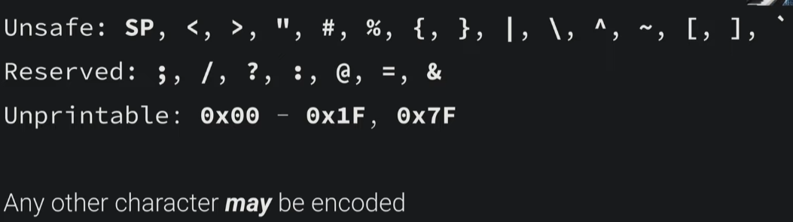

All distributed systems use a common language to communicate that is the HTTP

What humans perform are clicks or taps on web page but our browser acts on our behalf, it translates these clicks and generate http request in order to communicate with remote server and service the request

For world wide web to work, it needs internet, some sort system to transmit data and the way that works is internet

Maybe we cannot directly talk to our target system but we know someone who can talk to our target system
It is like a web
The internet is a network of networks

Network layer : Find the right destination
Transport layer : Find the right process, this is done using the concept of ports

RFC 1945 defines HTTP and standardizes it 
All the connected systems must have the same structure to send requests and replys

The RFC defines http as : 
The Hypertext Transfer Protocol (HTTP) is an application-level
protocol with the lightness and speed necessary for distributed,
collaborative, hypermedia information systems. It is a generic,
stateless, object-oriented protocol which can be used for many tasks,
such as name servers and distributed object management systems,
through extension of its request methods (commands). A feature of
HTTP is the typing of data representation, allowing systems to be
built independently of the data being transferred.

The top line is the http request is called request line

Request line = **Method** space **Request-URI** space **HTTP-Version** CRLF

HTTP response status line

Response line = **HTTP-Version** space **Status-Code** space **Reason-Phrase** CRLF

Status code definitions

- 1xx : **Informational** : Not used, but reserved for future use.
- 2xx : **Success** : The action was successfully received, understood and accepted
- 3xx : **Redirection** : Further action must be taken in order to complete the request 
- 4xx : **Client Error** : The request contains bad syntax or cannot be fulfilled 
- 5xx : **Server Error** : The server failed to fulfill an apparently valid request

**GET Method**

The GET method means retrieve whatever information (in the form of an
entity) is identified by the Request-URI. If the Request-URI refers
to a data-producing process, it is the produced data which shall be
returned as the entity in the response and not the source text of the
process, unless that text happens to be the output of the process.

**Content-Length** header : number of character or number of bytes in response 

**HTTP URL Scheme**

**scheme**://**host**:**port**/**path**?**query**#**fragment**

- scheme : protocol used to access the resource
- host : host that holds resource
- port : port for program servicing resource
- path : Identifies the specific resource
- query : Information that the resource can use
- fragment : Client information about the resource(isnt sent out in network request) 

Lets say we want to access the resource "/Hello World" from some host, this is not valid format that is accepted by http
The reason is there are spaces in the request line to separate the type of information being sent like "Method" "Path" "Http version"
So we cannot use space somewhere else in request line
The spaces are delimiting start and end of **URI**

Solution to this problem is encoding

URL Encoding = % HEX HEX

Hex is the ascii value, eg : %41 = 'A'
Space = %20

#### State

Http is a stateless protocol, so how to we maintain state?
Web application can be statefull, protocol can be stateless
We can log in but any future request wont remember that we have already logged in or not because the protocol itself is stateless
The protocol dosent keep track of clients state

Solution : Cookies
**Use HTTP headers to maintain state**
The server sets a cookie in response with the header : "Set-Cookie"
The client includes this cookie in future requests using the "Cookie" header

What is before we even login, we set our cookie value to admin? This should work since the protocol is stateless.
This is the security concern.
We can change cookie to an unguessable session ID. This is more secure than using guessable cookies
Its upto the web application on how to use cookies for state

