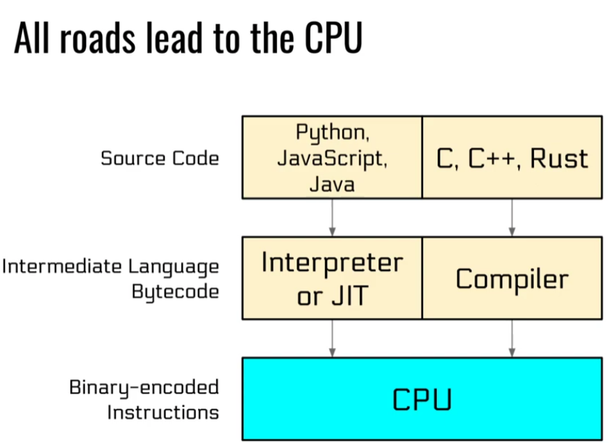
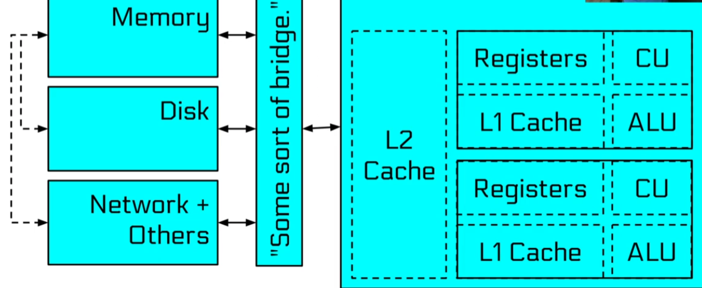
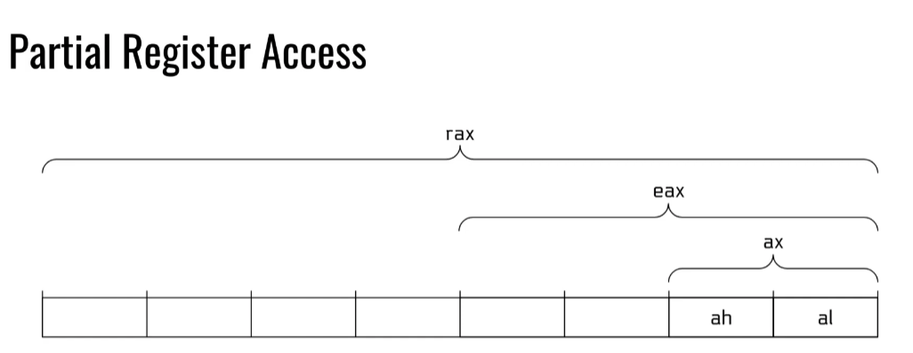
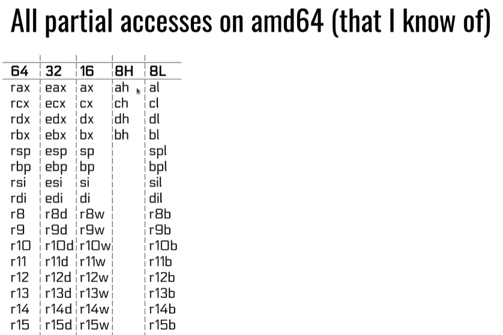
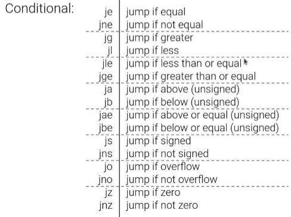

## Binary Files

ELF : Executable and Linkable Format, binary file format on Linux
It contains 
- Program and its data
- Describes how the program should be loaded(program/segment header)
- Contains metadata describing programs components(Section headers)

ELF Program Headers

Program headers specify information needed to prepare the program for execution. Most important entry types
- INTERP : defines the interpreter that should be used to load this ELF into memory
- LOAD : defines a part of the file that should be loaded into memory

Program headers are source of information when loading the file into the memory

To see program headers of a binary, we can use the 'readelf' utility

```sh
readelf -a binary
```

ELF Section Headers

A different view of the ELF with useful information for introspection, debugging etc.

Important Sections

- .text : executable code of our program 
- .plt & .got : used to resolve and dispatch library calls
- .data : used for preinitialized global writable data (such as global arrays with initial values)
- .rodata : used for global read only data(such as string constants)
- .bss : used for uninitialized global writable data(such as global array without initial values)

**Section headers are not necessary part of ELF, only segments(defined via program headers) are needed for loading and operation. Section headers are just metadata.**

Symbols 

Binaries and libraries that use dynamically loaded libraries rely symbols(names) to find libraries, resolve function calls into those libraries etc.

---

## Linux Process Loading

cat file.txt
1) A process is created
2) Cat is loaded
3) Cat is initialized
4) Cat is launched
5) Cat reads the envrionment and arguments
6) Cat does its things 
7) Cat terminates

We are interested in first 3 parts


##### Portrait of a Process

Every linux process has :

- state (running, waiting, stoppped, zombie)
- priority (and other scheduling information)
- parent, siblings, children
- shared resources (files, pipes, sockets)
- virtual memory space
- security context ( effective uid and gid, saved uid and gid, capabilities )

**But where do these process come from**

In linux, process propogate by mitosis.

***fork*** and more recently ***clone*** are system calls that create a nearly exact copy of calling process, a parent and a child
Later the child process ususally uses the 'execve' syscall to replace itself with another process
Example: 
- we type /bin/cat in bash 
- bash forks itself into the old parent process and the child process
- the child process 'execve' /bin/cat, becoming /bin/cat

***In the loading process, we need to know, can we load?***

Before anything is loaded, the kernel checks for executable permissions. If file is not executable, 'execve' will fail

***If we have correct permissions, the kernel has to decide What to load?***

To figure out what to load, the linux  kernel reads the beginning of file(ie /bin/cat) and makes the descision

1) If the file starts with '#!'(shbang, the kernel will treat this as a script file), the kernel extracts the interpreter from the rest of that line and executes this interpreter with the original file as an argument 
2) If the file matches a format in '/proc/sys/fs/binfmt_misc', the kernel executes the interpreter specified for that format with the original file as an argument 
3) If the file is dynamically linekd ELF, the kernel reads the interpreter/loader defined in the ELF, loads the interpreter and original file and lets the interpreter take control.
4) If the file is a statically linked ELF, the kernel will load it
5) Other legacy file formats are checked for.

These can be recurssive!

**The file extension does not matter to know what type of file it is, only the beginning of file matters to figure out the type of file.**

Interpreter/loader can also be modified using a tool called patchelf
```sh
patchelf --set-interpreter /some/interpreter /binary/which/requires/new/interpreter
```

#### Dynamically Linked ELF: The loading process

1) The program and its interpreter are loaded by the kernel
2) The interpreter locates the libraries
    - LD_PRELOAD environment variable and anything in /etc/ld.so.preload
    - LD_LIBRARY_PATH environment variable (can be set in the shell)
    - DT_RUNPATH or DT_RPATH specified in the binary file(both can be modified with patchelf)
    - system-wide configuration(/etc/ld.so.conf)
    - /lib and /usr/lib
3) The interpreter loads the libraries
    - these libraries can depend on other libraries, causing more to be loaded
    - relocations updated


'strace' goes throgh a binary and prints out all the system calls

***Where is all this getting loaded to?***

Each linux process has a virtual memory space. It contains:
    - the binary
    - the libraries
    - the heap(for dynamically allocated memory)
    - the stack(for functions and local variables)
    - any memory specifically mapped to the program
    - some helper regions
    - kernel code in the "upper half" of memory (above 0x8000000000000000 on 64 bit architechtures)

Virtual memory is dedicated to our process
Physical memory shared amongst whole system

We can see this whole space by looking at /proc/self/maps

***The Standard C Library***

Libc is a library full of helper functions that is linked by almost every process
Provides functionality like 
- printf()
- scanf()
- socket()
- atoi()
- malloc()
- free()

#### Statically Linked ELF: The loading process

1) The binary is loaded

```sh
gcc -static file.c -o file
```

Statically linked files take up lot more space that dynamically linked files because all the libraries are inside the binary also bugs from libraries statically linked in will have to be patched by the application developer, and not the library developer. This often means that 0-day patch releases to vulnerable libraries will not cover applications statically linked to those libraries.

Also when compiling with '-static' flag, by default the program is loaded into the same address when its ran, so no PIE(Position Independent Executable)
To have statically linked file and also have PIE protection on, we need to compile with the flag '-static-pie'


### Process Initialization

After everything is loaded into memory, it is initialized
Every ELF binary can specify 'constructors' which are functions that run before the program is actually launched
'Constructos' run before program execution starts, before main is executed

We can specify our own constructor

```c
__attribute __((constructor)) void haha(){
    write(1,"haha!\n",6); // 1: this is file descriptor for stdout(standard output)
    // next is the string literal
    // 6 : number of bytes to write
}
int main(int argc, char **argv){
    printf("Hello world");
    return 0;
}
```
In this code, the constructor will be executed first and then our main function

---

## Program Interaction

This is the 4th step in process life cycle stage, "Process Launched" or "Process "Execution", in our case 'Cat is launched'

A normal ELF automatically calls '__libc_start_main()' in libc which in turn calls the programs 'main' function
Then our program starts to execute.

Now what?

Cat reads arguments and environment 

Your process's entire input from outside world comprises of 
- the loaded objects(binaries and libraries)
- command line argument in argv
- environment in envp

```c
int main(int argc, void** argv, void **envp);
```

"Cat does its things"

How to programs achieve their functionality?

**Using library functions**

The binaries import symbols have to be resolved using libraries export symbols
In the past this was an on demand process and carried great peril
In mordern times, this is all done when the binary is loaded and is much safer


To look the symbol table, we can use 'nm' tool

```sh
nm -D binaryFile
```

The functions and globals that our binary imports will be printed out using this command

To check all the symbols 

```sh
nm -a bianryFile
```

#### Interacting with the environment 

Almost all programs have to interact with outside world
This is primarily done via system calls(syscalls). Each system call is well documented in 'man' pages
We can trace process system calls using 'strace'

'strace' prints out the system calls to stderr(2)(standard error) and prints binary to stdout(1)(standard output)
Each syscall has a number associated with it

##### System Calls

System calls have very well defined interfaces that rarely change. There are over 300 system calls in linux

##### Signals

System calls are a way for process's to call or use the functionality of OS. What about other way around? How can the OS talk to us?

Signals: relevant system calls
- Signals pause execution and invoke the handler
- Handlers are functions that take one argument: the signal number
- Without handler for a signal the default action is used(often, kill)
- SIGKILL(signal 9) and SIGSTOP(signal 19) cannot be handled

Each signal has signal handler(the function that executes) otherwise a default action is performed

SIGSTOP is when backgrounding a process(when we press CTRL+Z). There are 2 variants of SIGSTOP(19 and 20, when we press CTRL+Z its 20 which we can catch, siganl 19 we cannot and we have to do it manually)

To find process id quickly

```sh
ps aux | grep processName
//OR
pgrep processName
```
'pgrep' returns the process ID only

##### Shared Memory

Another way of interacting with outside world is by sharing memory with other process.
**Requires system calls to establish, but once established, communication happens without system calls**

Easy way : use a shared memory-mapped file is /dev/shm.

'Cat Terminates'

***Process Termination***

Process terminate by one of the two ways

1) Receiving an unhandled signal
2) Calling exit() system call 

All process must be "reaped"
- after termination, they will remain in zombie state until they are wait()ed on by thier parent
- When this happens, their exit code will be returned to the parent and the process will be freed
- if their parent dies without wait()ing on them, they are re-parented to PID 1 and will stay there until they are cleaned up

What about segmentation fault? What kind of termination is that?

Seg fault is a siganl. When our process crashes, it receives signal 11 and terminates because it does not have a handler


--- 

## Assembly 

The only true programming language as far as CPU is concerned

Concepts
1) Instructions
    - data manipulation instructions
    - comparison instructions
    - control flow instructions
    - system calls
2) Regiters
3) Memory
    - program
    - stack 
    - other mapped memory


#### Registers

Very fast temporary data storage
The address of next instruction is in register
eip(x86), rip(amd64), r15(arm)



Registers can be partially accessed
**Due to historical oddity, accessing eax will zero out the rest of rax. Other partial access preserve unotouched parts**



#### Instructions

General form
OPCODE OPERAND OPERAND ...
OPCODE : what to do
OPERANDS : what to do it on/with

##### Data Manipulation Instructions

Instructions that can move and manipulate data in registers and memory

In intel assembly format, data flow from right to left

```asm
mov rax, rbx # move data from rbx to rax
mov rax, [rbx+4] # this is a memory access, we take rbx, add 4 to it and it gives a number, in memory we look at that location number
add rax, rbx # similar to writing rax = rax + rbx
mul rsi # rax = rax * rsi only takes one argument, it multiplies whatever is in rax with the argument as the multiplier, stores overflow in rdx
inc rax # increments rax by 1
inc [rax] # increment the memory location pointed to by rax
```

##### Control Flow Instructions

Control flow is determined by conditional and unconditional jumps

Unconditional : call, jmp, ret
Conditional : 


Conditional key off of the flag register
eflag(x86), rflags(amd64), aspr(arm)
Updated by (x86/amd64)
- arithematic operation
- cmp-subtraction(cmp rax, rbx) # compare instruction performs the subtraction, discards the result but updates the flag
- test-and(test rax, rax)

##### Instructions - System Calls

Almost all programs have to interact with outside world
This is primarity done via system calls

System calls on amd64 are triggered by
1) set rax to system call number
2) store arguments in rdi, rsi etc
3) call the syscall instruction

To compile an assembly file using gcc

```sh
gcc -nostdlib file.s -o file
```

'-nostdlib' to not link libc


#### Memory

The stack fulfills 4 main uses

1) Track the call stack of the program
    - return values are pushed onto stack during a call and popped during ret
2) Contain local variable of functions
3) Provide scratch space(to alleviate register exhaustion)
4) Pass function arguments(always on x86, only for functions with many arguments on other architechtures)


##### Memory : Other Mapped Regions

Other regions may be mapped in memory. Some regions loaded due to directives in the ELF headers, but functionality such as 'mmap' and 'malloc' can cause other regions to be mapped as well

***Signedness: Twos's compliment***

How to diffrentiate between positive and negative number

One idea : Signed bit, stored in different register
if it is 1: then number is negative, if it is 0 then number is positive
But arithematic operation need to be signedness aware for these
We have 2 representation of 0, a positive and a negative, this is matematically weird

Other approach : Twos complement
Advantage : arithematic operation dont have to be signed aware
drawback : we might go crazy

0 - 1 = b11111111 = 0xff = -1
(unsigend) b11111111 + 1 = 255 + 1 = 0 = b00000000 
(signed)   b11111111(-128+127=-1) + 1 = -1 + 1 = b00000000

So adding 1 to 0xff is the same regardless of whether 0xff represents -1 or 255

##### Calling Conventions

Callee and Caller functions must agree on argument passing
Linux x86 : push arguments in reverse order then return value in eax
Linux amd64 : rdi, rdi, rdx, rcx, r8, r9, return value in rax
Linux arm : r0, r1, r2, r3, return value in r0

**Registers are shared between functions so calling convention should agree on what registers are**